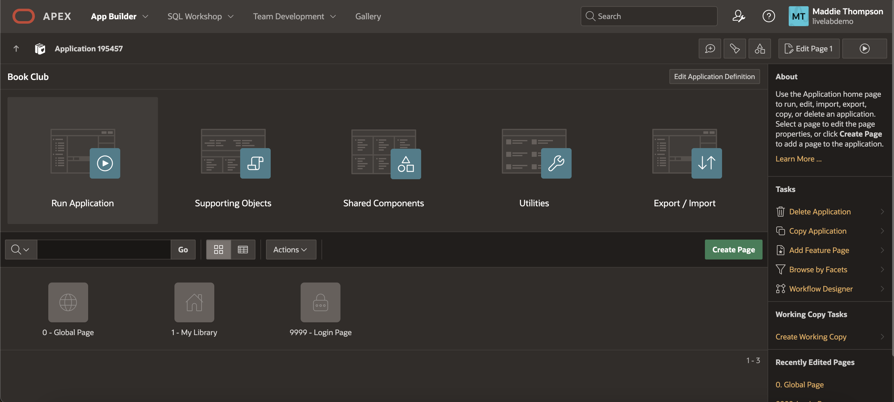

# Create the Application

## Introduction

You will get started by creating a skeleton application and you will add to it in each lab until you have built a full application that allows you to create and manage a personal list of books you have read or want to read.

You will also need to sign up for an account on Google Books and obtain an API Key. A Google Books API Key is required for this tutorial, as authentication is needed to get data from the Google Books API.

Estimated Lab Time: 10 minutes

### Objectives
In this lab, you will:  
- Create a new application.  
- Edit the appearance and theme of your application.  
- Run your application.  
- Sign up for a Google Books API key.

### Prerequisites
- An Oracle APEX workspace

## Task 1: Create the App

1. If you have not already logged into your Oracle APEX workspace, sign in using the workspace name, email, and password you signed up with.

    

2. At the top left of your workspace, click **App Builder**.

    

3. On the App Builder page, click the **Create** button.

    

4. Select the **Use Create App Wizard** option.

    

5. In the Create an Application wizard, set Name to **Book Club**.

6. On the Create Application page, click the application icon.
   

7. In the Choose Application Icon wizard, upload your own icon by selecting or dragging and dropping an image. Download a sample icon from [here](images/book-club-logo.png).
  

8. Once you select an image, the wizard allows you to crop or resize the image. Click **Save Icon**.
    

9. In the Pages section of the Create Application wizard, click the **Edit** button next to Home.

    

    * In the dialog, set Page Name: **My Library**

    * Click the **Set Icon** button.

        - In the Select Icon dialog, search for **book**.

        - Click the book icon.

    * Click **Save Changes**.

    

10. Click **Create Application** to create your app and go to the application home page.

    

## Task 2: Run the App

1. On your application home page, click **Run Application**.

    

2. On the sign in page that opens in a new tab in your browser, enter your username and password that you used to sign in to your workspace.

3. Click **Sign In**.

    

## Task 3: Update the Theme of the App

1. In the tab that your app is running in, there will be a grey toolbar at the bottom of the page. This is your development toolbar that allows you to edit regions in your application user interface (UI) directly in the tab it's running in.  
*Note: If you do not see the grey developer toolbar, mouse over the bottom of your browser window to make it display. End users who log directly into the app will not see this toolbar.*

2. In the dev toolbar, click on **Customize** and then click **Theme Roller**.

    

3. Within the Theme Roller, you can modify many different aspects of the application UI. 

2. In the Theme Roller dialog, enter/select the following: 
    - Select Theme: **Redwood Light**
    - Under Redwood Options:
        - Pillar: **Lilac**
    - Under Appearance:
        - Header: **Dark**
        - Navigation: **Dark**
        - Body Header: **Dark**

    

3. Click **Save As**. In the dialog, for Style Name, enter **Redwood Light Custom**. Finally, click **Save**.
    

    
    
    You have successfully customized the application theme.

## Task 4: Sign up for a Google Books API Key

1. Go to [Google Cloud](https://console.cloud.google.com/apis/credentials) to sign up for a free account.

2. Once registered, follow the [Using the API](https://developers.google.com/books/docs/v1/using#APIKey) instructions on Google Books API site. You will need to create a credential. If you are prompted to create a project for the key first, name the project **Book Club**. Click **Create Credentials** then select **API Key** from the dropdown menu.

    

3. After you have received your API Key, copy it and store it somewhere where you will be able to easily access it.

You now know how to create, run, and update the theme of an application. You may now **proceed to the next lab**.

## Acknowledgements

- **Author** - Maddie Thompson, Sakthi Gopinath
- **Last Updated By/Date** - Maddie Thompson, November 2024
