# Implement Ratings and Reviews

## Introduction
In this lab, you will be creating a Rate Book button on the Book Details page that will link to the form page you created in the last lab. You will also add a cards region to the Book Details page to display the book reviews. Additionally, you will implement review card action buttons that allow a user to edit or delete their review post.

Estimated Lab Time: 20 minutes

### Objectives
In this lab, you will:
- Implement a Rate Book button that opens the new form page created in the last lab.
- Create a cards region on the Book Details page to display book reviews.
- Implement card actions to enable users to edit or delete their post.
- Create additional users to test out the new functionality.

### Prerequisites
- Completion of workshop through Lab 9

## Task 1: Create the Rate Book Button

1. Right-click the Breadcrumb region and select **Create Button**.

    * Identification → Button Name: **RATE\_BOOK**

    * Layout → Slot: **Create**

    * Appearance → Button Template: **Text with Icon**

    * Appearance → Hot: **on**

    * Appearance → Icon: **fa-star-o**

    * Behavior → Action: **Redirect to Page in this Application**

    * Click on **No Link Defined** next to Target to open the Link Builder dialog.

        - Page: **5**

        - Set Items:

            - Name: **P5\_BOOK\_ID**  |  Value: **&P3\_ID.**

        - Clear Cache: **5**

        - Click **Ok**

    

2. A user should not be able to rate a book until they've added it to their library and marked it as read. To accomplish this, you are going to add Server-Side Conditions.

3. With the **RATE\_BOOK** button still selected, scroll down to the **Server-side Condition** property group and set the following properties:

    * Type: **Rows returned**

    * SQL Query:

        ```
        <copy>
        select null
          from library
        where book_id = :P3_ID
          and user_id = :USER_ID
          and read_yn = 'Y'
        ```

        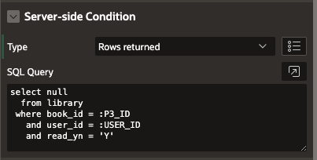

4. If the user has already rated the book, the Rate Book button should not show. You will need to add a dynamic action to the button to accomplish this.

5. Right-click on **RATE\_BOOK** and select **Create Dynamic Action**.

    * Identification → Name: **Hide RATE_BOOK button**

    * Server-side Condition → Type: **Rows returned**

    * Server-side Condition → SQL Query:

        ```
        <copy>
        select null
           from reviews
         where book_id = :P3_ID
           and created_by = :APP_USER
        ```

    

6. Click on the **True** Action (Refresh) under the Dynamic Action and set the following properties:

    * Identification → Action: **Hide**

    * Affected Elements → Selection Type: **Button**

    * Affected Elements → Button: **RATE\_BOOK**

    

## Task 2: Create the Reviews Region

1. In the rendering pane, click on **Page 3: Book Details**.

2. Scroll down to the CSS property group.

3. Copy the code below and paste it within the Inline code editor:

    *Note: you should already have code here, so paste the following code at the end (do not replace the existing code)*

    ```
    <copy>
    /* position date posted in bottom corner of card */
    .post-date {
        font-size: 12px;
        color: gray;
        position: absolute;
        bottom: 16px;
        right: 16px;
    }

    /* style pace as pill */
    .pace {
        border-radius: 10px;
        padding: 4px 8px;
        margin-right: 8px;
    }

    /* style moods as pills */
    .mood {
        background-color: #EBEFFE;
        border-radius: 10px;
        padding: 4px 8px;
        margin-right: 8px;
    }

    /* do not display null items */
    .mood[data-value=""] {
        display: none;
    }

    /* customize look of card actions - remove background color, place in top right corner of card */
    .a-CardView-actions {
        background-color: white;
    }

    .a-CardView-items--row .a-CardView-actions {
        align-items: flex-end;
        grid-column-start: auto;
        grid-row: 1;
    }
    ```

    

4. Right-click on the Body position in the rendering tree and select **Create Region**:

    * Identification → Name: **Community Ratings & Reviews**

    * Appearance → Template: **Content Block**

    * Appearance → Template Options:

        - Region Title: **Small**

        - Top Margin: **Medium**

        - Click **Ok**.

        

5. Right-click on the **Community Ratings & Reviews** region and select **Create Sub Region**:

    * Identification → Name: **My Review**

    * Identification → Type: **Cards**

    * Source → Type: **SQL Query**

    * Copy the code below and paste it into the SQL Query code box:

        ```
        <copy>
        select 
        r.id,
        r.book_id,
        r.created_by as user_name,
        r.post_comment as comment_text,
        r.rating,
        r.full_name,
        r.pace,
        apex_util.get_since(r.updated) as post_date,
        r.mood,
        REGEXP_SUBSTR(r.mood, '[^:]+', 1, 1) as MOOD1,
        REGEXP_SUBSTR(r.mood, '[^:]+', 1, 2) as MOOD2,
        REGEXP_SUBSTR(r.mood, '[^:]+', 1, 3) as MOOD3,
        REGEXP_SUBSTR(r.mood, '[^:]+', 1, 4) as MOOD4,
        REGEXP_SUBSTR(r.mood, '[^:]+', 1, 5) as MOOD5,
        REGEXP_SUBSTR(r.mood, '[^:]+', 1, 6) as MOOD6,

        case when r.pace = 'Slow' then 'slow-paced'
                    when r.pace = 'Medium' then 'medium-paced'
                    when r.pace = 'Fast' then 'fast-paced'
            end as badge_label,
            case when r.pace = 'Slow' then 'u-color-24-bg'
                    when r.pace = 'Medium' then 'u-color-23-bg'
                    when r.pace = 'Fast' then 'u-color-20-bg'
            end as badge_color

        from reviews r
        where r.created_by = :APP_USER
            and r.book_id = :P3_ID
        order by r.created desc
        ```

        *Note: The Mood form field is a checkbox group, which stores the values in a delimited list separated by a colon; the code above loops through the list and separates each value. The code above also assigns a badge label and color to the Pace field depending on the value.*

    * Appearance → Template Options:

        - Style: **Style A**

        - Click **Ok**

        

    * Server-side Condition → Type: **Rows returned**

    * Server-side Condition → SQL Query:

        ```
        <copy>
        select null
           from reviews
         where book_id = :P3_ID
           and created_by = :APP_USER
        ```

        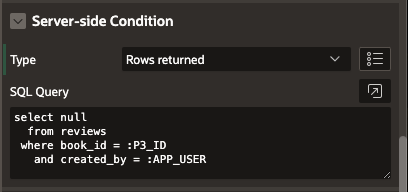

6. Go to the Attributes tab of your new My Review region to customize your Review card.

    * Appearance → Layout: **Horizontal (Row)**

    * Card → Primary Key Column 1: **ID**

    * Title → Column: **FULL\_NAME**

    * Subtitle → Advanced Formatting: **on**

    * Subtitle → HTML Expression:

        ```
        <copy>
        &lt;span class="fa u-hot-text report-star-rating" data-rating="&RATING." title="&RATING." aria-hidden-"true">&lt;/span>&lt;span class="u-VisuallyHidden">&RATING.&lt;/span>
        &lt;span title="Post Date" class="post-date"> &POST_DATE.&lt;/span>
        ```

    * Body → Column: **COMMENT\_TEXT**

    * Secondary Body → Advanced Formatting: **on**

    * Secondary Body → HTML Expression:

        ```
        <copy>
        &lt;br>
        &lt;span class="mood" data-value="&MOOD1.">&MOOD1.&lt;/span>
        &lt;span class="mood" data-value="&MOOD2.">&MOOD2.&lt;/span>
        &lt;span class="mood" data-value="&MOOD3.">&MOOD3.&lt;/span>
        &lt;span class="mood" data-value="&MOOD4.">&MOOD4.&lt;/span>
        &lt;span class="mood" data-value="&MOOD5.">&MOOD5.&lt;/span>
        &lt;span class="mood" data-value="&MOOD6.">&MOOD6.&lt;/span>
        &lt;span class="&BADGE_COLOR. pace">&BADGE_LABEL.&lt;/span>
        ```

    

    * Icon and Badge → Icon Source: **Initials**

    * Icon and Badge → Icon Column: **FULL\_NAME**

    * Icon and Badge → Icon CSS Classes: **u-color-13**

    

7. You also need to create a Cards region to display other user's reviews. It will be almost exactly like the My Review region, with a few minor changes.

8. Right-click on the **My Review** region in the rendering pane and select **Duplicate** to create a copy of the region.

9. Set the following properties:

    * Identification → Name: **Community Reviews**

    * Source → replace the existing SQL query with the following:

        ```
        <copy>
        select 
        r.id,
        r.book_id,
        r.created_by as user_name,
        r.post_comment as comment_text,
        r.rating,
        r.full_name,
        r.pace,
        apex_util.get_since(r.created) as post_date,
        r.mood,
        REGEXP_SUBSTR(r.mood, '[^:]+', 1, 1) as MOOD1,
        REGEXP_SUBSTR(r.mood, '[^:]+', 1, 2) as MOOD2,
        REGEXP_SUBSTR(r.mood, '[^:]+', 1, 3) as MOOD3,
        REGEXP_SUBSTR(r.mood, '[^:]+', 1, 4) as MOOD4,
        REGEXP_SUBSTR(r.mood, '[^:]+', 1, 5) as MOOD5,
        REGEXP_SUBSTR(r.mood, '[^:]+', 1, 6) as MOOD6,

        case when r.pace = 'Slow' then 'slow-paced'
                    when r.pace = 'Medium' then 'medium-paced'
                    when r.pace = 'Fast' then 'fast-paced'
            end as badge_label,
            case when r.pace = 'Slow' then 'u-color-24-bg'
                    when r.pace = 'Medium' then 'u-color-23-bg'
                    when r.pace = 'Fast' then 'u-color-20-bg'
            end as badge_color

        from reviews r
        where r.created_by <> :APP_USER
            and r.book_id = :P3_ID
        order by r.created desc
        ```

        *Note: The only difference between the code for this region and the code for the My Review region is the WHERE clause; in this case you want to display reviews that are NOT created by the current user.*

    * Server-side Condition → Type: **Rows returned**

    * Server-side Condition → replace the existing SQL query with the following:

        ```
        <copy>
        select null
           from reviews
         where book_id = :P3_ID
           and created_by <> :APP_USER
        ```

    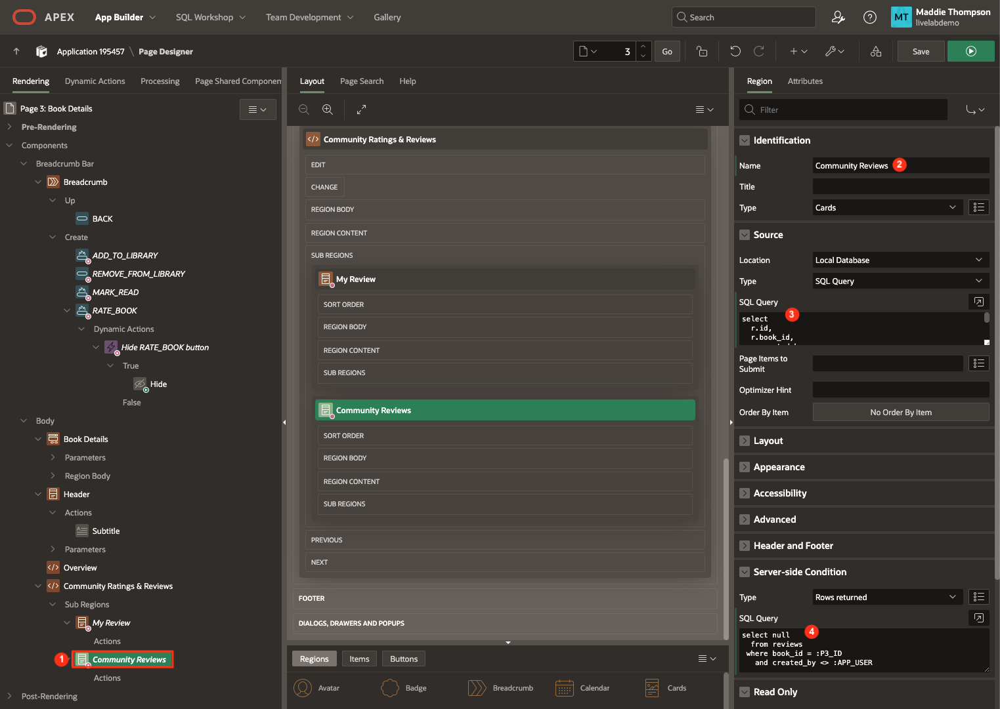

10. You are going to create one more sub region that displays when no reviews exist for a book.

11. Right-click on the **Community Ratings & Reviews** region and select **Create Sub Region**:

    * Identification → Name: **No Reviews**

    * Source → HTML Code:

        ```
        <copy>
        No community reviews yet
        ```

    * Appearance → Template: **Blank with Attributes**

    * Server-side Condition → Type: **No Rows returned**

    * Server-side Condition → SQL Query:

        ```
        <copy>
        select null
            from reviews
          where book_id = :P3_ID
        ```

    

## Task 3: Add JavaScript to the Page for the Card Buttons
In this task, you will provide the APEX page with the custom javascript that will be invoked by the "URL" from the Card button target link, to the Dynamic action that you will create.

1. In the rendering pane, click on **Page 3: Book Details**.

2. Scroll down to the JavaScript property group. For **Execute when Page Loads**, enter the following javascript code:

        ```
        <copy>
        apex.actions.add([{
            name: "delete",
            action: (event, element, args) => {
                apex.items.P3_ACTION_ID.value = args.id;
                apex.event.trigger(document, 'action-delete');
                }
            }]);
        ```

    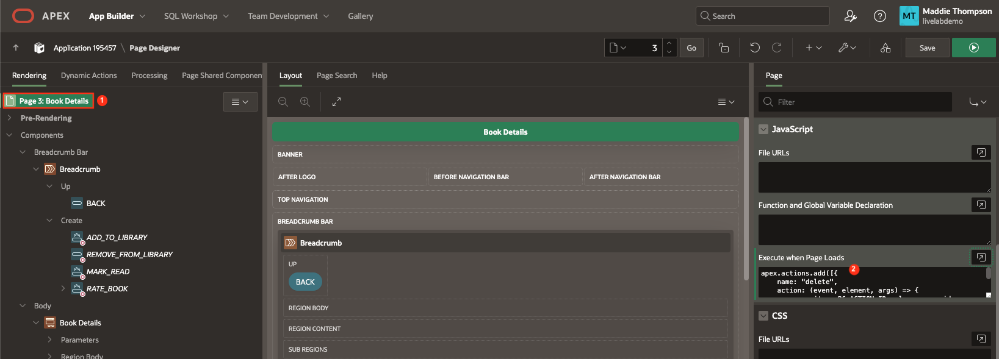

    Notice that the code references a Page Item, P3_ACTION_ID with a squiggly underline, which you have not created yet.

    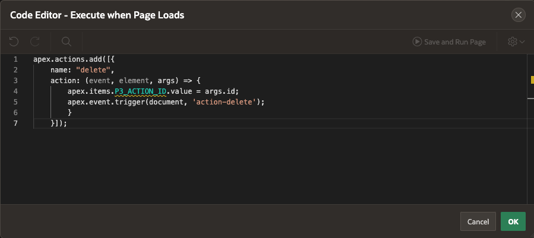

    You need this Page Item P3_ACTION_ID to be on the page so that this javascript can store the particular CARD ID when a user clicks the delete button, which in turn, will execute the delete operation from the URL link targets.

    This is a design pattern using a single APEX Javascript API call (on page load) with an array of multiple code blocks as parameters. Each respective javascript block will then in-turn call a custom event, which we will configure our Dynamic Actions to respond to in the next task.

3. To create and configure P3_ACTION_ID Page Item, right-click on the **My Review** Sub Region in the Rendering Tree and select **Create Page Item**.

    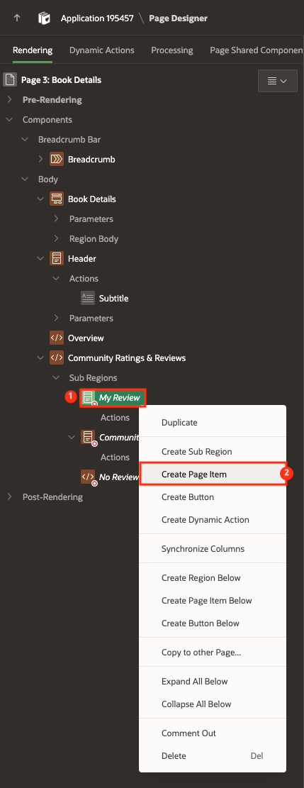

4. Set the following properties:

    * Identification → Name: **P3_ACTION_ID**

    * Identification → Type: **Hidden**

    * Settings → Value Protected: **off**

    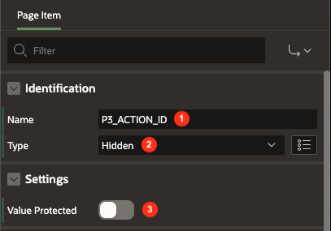

## Task 4: Create Card Buttons
In this task, you will add two buttons to the My Review card that enable the user to either edit or delete their review post. Since you've already added a condition to the My Review card sub region, the card we are adding buttons to will only display when the post belongs to the logged in user.

1. Right-click on **Actions** underneath the My Review sub region and select **Create Action**:

    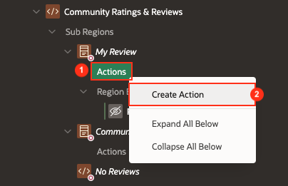

    * Identification → Label: **Edit**

    * Click on **No Link Defined** next to Target to open the Link Builder dialog.

        - Page: **5**

        - You also need to set the value of the ID item on page 5 (P5\_ID) so that the Rate Book page has the ID of the review that was clicked on.

        - Set Items:

            - Name: **P5\_ID**  |  Value: **&ID.**

        - Click **Ok**.

        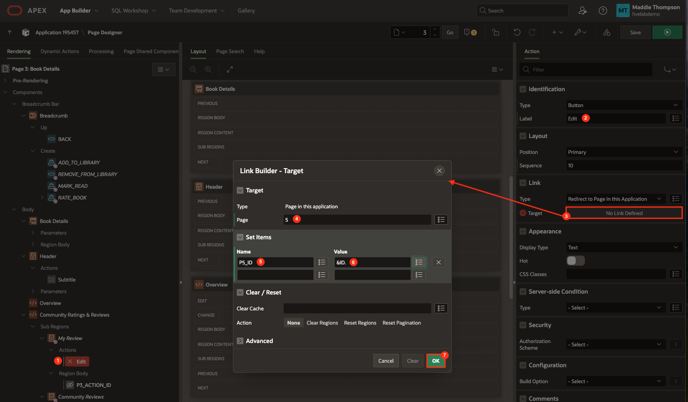

    * Appearance → Display Type: **Icon**

    * Appearance → Icon: **fa-pencil**

    * Appearance → CSS Classes: **t-Button--noUI**

    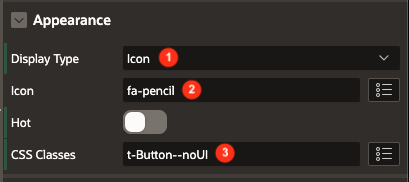

2. Right-click on **Actions** underneath the My Review sub region and select **Create Action**:

    * Identification → Label: **Delete**

    * Link → Type: **Redirect to URL**

    * Click on **No Link Defined** next to Target to open the Link Builder dialog.

        - URL: **#action$delete?id=&ID.**

        - Click **Ok**.

        

    * Appearance → Display Type: **Icon**

    * Appearance → Icon: **fa-trash-o**

    * Appearance → CSS Classes: **t-Button--noUI**

    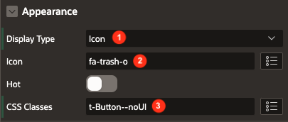

## Task 5: Implement Delete Card Action

1. From the Rendering pane, navigate to the **Dynamic Actions** tab.

2. Right-click on **Events** and select **Create Dynamic Action**.

    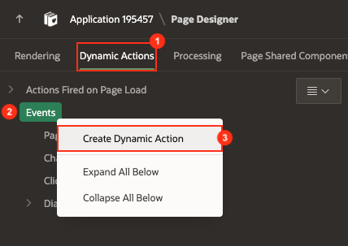

3. Set the following properties for the new dynamic action:

    * Identification → Name: **action-delete**

    * When → Event: **Custom**

    * When → Custom Event: **action-delete**

    * When → Selection Type: **JavaScript Expression**

    * When → JavaScript Expression: **document**

    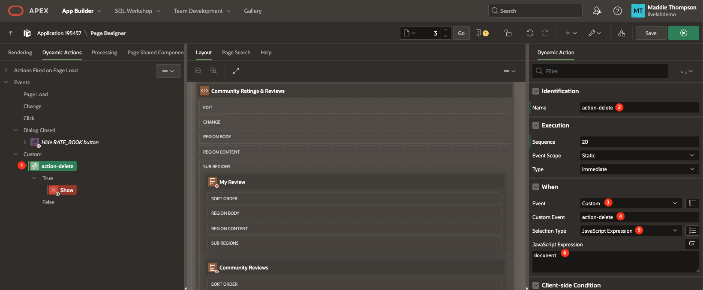

4. Now you'll need to configure the True actions for the action-delete Dynamic Action. There are 4 actions desired here:

    * Confirm deletion

    * Invoke the database work necessary to delete the desired post (PL/SQL)

    * Update the UI on the client by removing the deleted post

    * Display a success message

5. Navigate to the **True Action > Show** button and set the following properties:

    * Identification → Name: **Confirm dialog**

    * Identification → Action: **Confirm**

    * Settings → Title: **Are you sure?**

    * Settings → Message: **You are about to delete this post.**

    * Settings → Confirm Label: **Delete**

    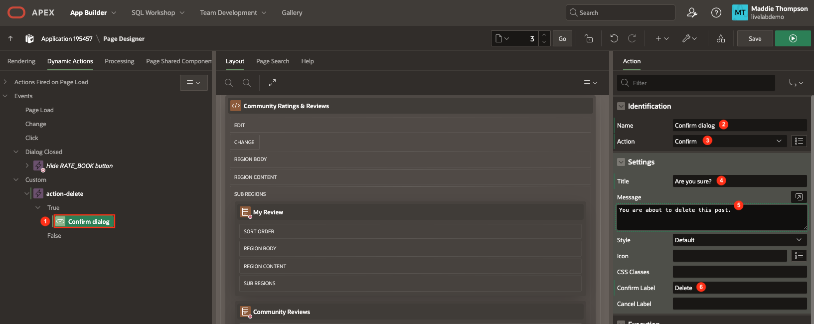

6. Next, we need to add another True Action to do the database work and delete the post record from the table. Right-click on the **True** title within the action-delete Dynamic Action and select **Create TRUE Action**:

    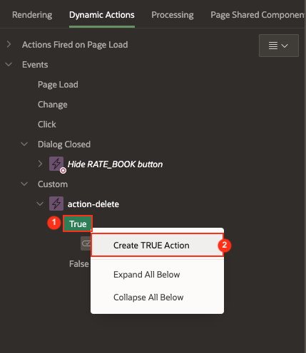

    * Identification → Name: **Do database work**

    * Identification → Action: **Execute Server-side Code**

    * Settings → PL/SQL Code:

        ```
        <copy>
        delete from REVIEWS where id=:P3_ACTION_ID and created_by=:APP_USER;
        ```

    * Settings → Items to Submit: **P3\_ACTION\_ID**

    *Note: The code block needs to receive the Page Item value for the P3\_ACTION\_ID value as defined by the button in the Cards report for each post that shows the delete button/icon. This is handled by providing the Page Items to Submit to the Server.*

    

7. After the row is deleted, you need to remove the post from the UI. To do this, right-click on the **True** entry under the **action-delete** custom event, and select **Create TRUE Action**:

    * Identification → Name: **Remove post from UI**

    * Identification → Action: **Execute JavaScript Code**

    * Settings → Code:

        ```
        <copy>
        $('[data-id='+apex.items.P3_ACTION_ID.value+']').remove();
        ```

    * Settings → Items to Submit: **P3\_ACTION\_ID**

    

8. Finally, you want to show a success message, similar to what you have for when a post is created or updated. Right-click on the **True** entry under the **action-delete** custom event, and select **Create TRUE Action**:

    * Identification → Name: **Display success message**

    * Identification → Action: **Execute JavaScript Code**

    * Settings → Code:

        ```
        <copy>
        apex.message.showPageSuccess("Post deleted!");
        ```

    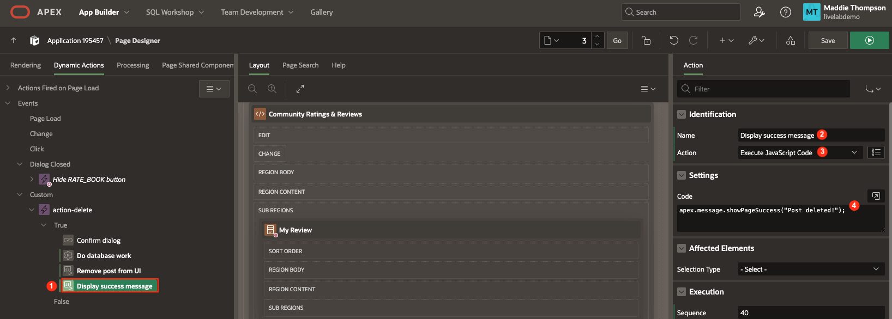

9. Click **Save**.

10. Refresh the page where your application is running.

11. Add a book to your library and mark it as read so the **Rate Book** button appears.

    

12. Test the Rate Book page by clicking the Rate Book button to open the form page.

    

    * You can test out the form field validations by selecting more than 6 mood checkboxes or by leaving the star rating empty. You should receive both an inline error notification and an error popup message upon clicking the Post button.

    

13. Fill out the form details then click the **Post** button.

    * The dialog should close and you should see a success message in the top right of the screen and your review post at the bottom.

    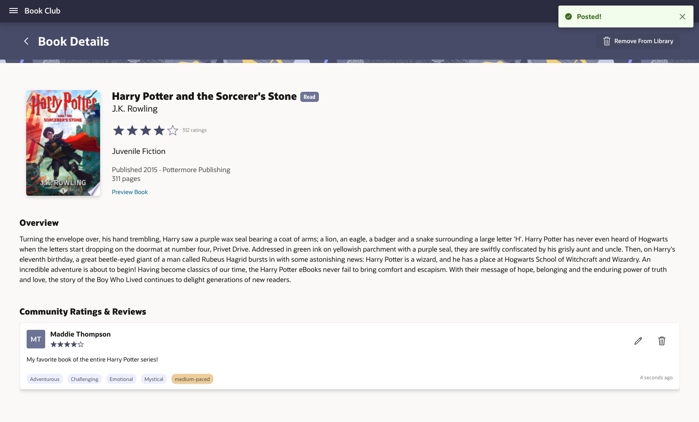

14. Test out the edit functionality by clicking the edit icon button on your review post.

    * The Rate Book dialog page should open with your previously saved values populated in the form fields.

    * The form submit button should say Save instead of Post.

    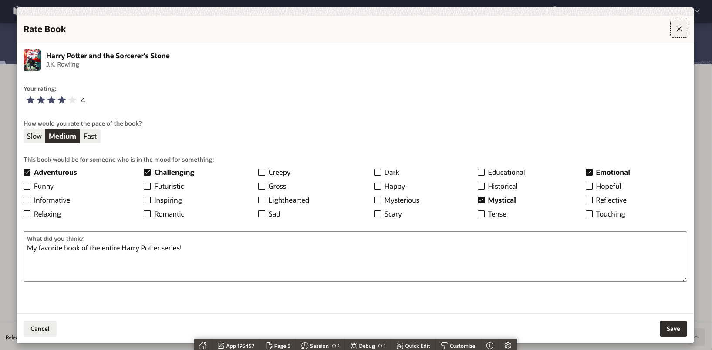

    * Update some values and click **Save**.

    * The review post's values should update accordingly and a success message should appear in the top right corner of the page.

    

15. Now test out the delete functionality by clicking the delete icon button on your review post.

    * A confirmation dialog should appear.

    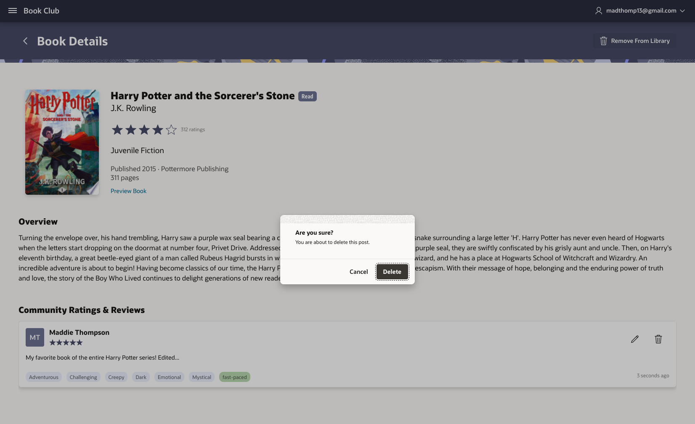

    * Upon clicking delete, the post should be removed from the UI and a success message should appear in the top right corner of the page.

    


You have now completed your Book Club application and can search for books, add them to your library, and write reviews. However, there are many ways to continue to add functionality to and customize your application.

## Acknowledgements

- **Author** - Maddie Thompson
- **Last Updated By/Date** - Maddie Thompson, November 2024