# Create the Book Review Form and Table

## Introduction
In this lab, you will create a form page for users to review a book and a table to store the review data. You will also create form field validations and implement form buttons.

Estimated Lab Time: 20 minutes

### Objectives
In this lab, you will:
- Create an application item and computation for storing the user's full name.
- Create a table to store book review posts.
- Create a new form page for the user to rate and review the book.
- Create form field validations.
- Create a book overview card to be displayed in the Dialog header.
- Define and implement form dialog buttons.

### Prerequisites
- Completion of workshop through Lab 8

## Task 1: Create the Application Item and Computation
To obtain a user's full name, you will use an application computation. The computation uses :APP_USER to retrieve the current user's first and last name, then concatenates the two. You will create an application item to store this value.
*Note: You are going to store this value in the Reviews table later on so you can display the user's name and initials when they post a book review.*

1. Click on **App Builder** in the top APEX toolbar.

2. Click on your **Book Club** app.

3. Click on **Shared Components**.

4. In the Application Logic section of the page, click **Application Items**.

    

5. Click **Create**.

    * Name: **FULL\_NAME**

    * Click **Create Application Item**.

    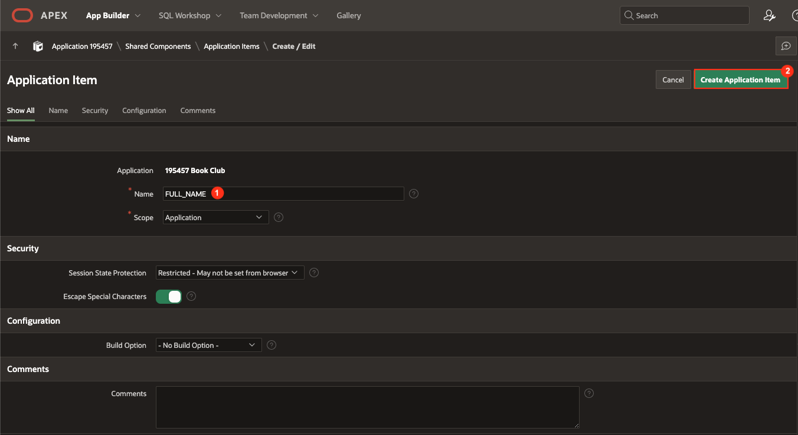

6. Go back to Shared Components and click on **Application Computations**.

    

7. Click **Create**.

    * Computation Item: **FULL\_NAME**

    * Computation Point: **After Authentication**

    * Computation Type: **Expression**

    * Computation:

    ```
    <copy>
    apex_util.get_first_name(:app_user) || ' ' || apex_util.get_last_name(:app_user)
    ```

    * Click **Create Computation**.

    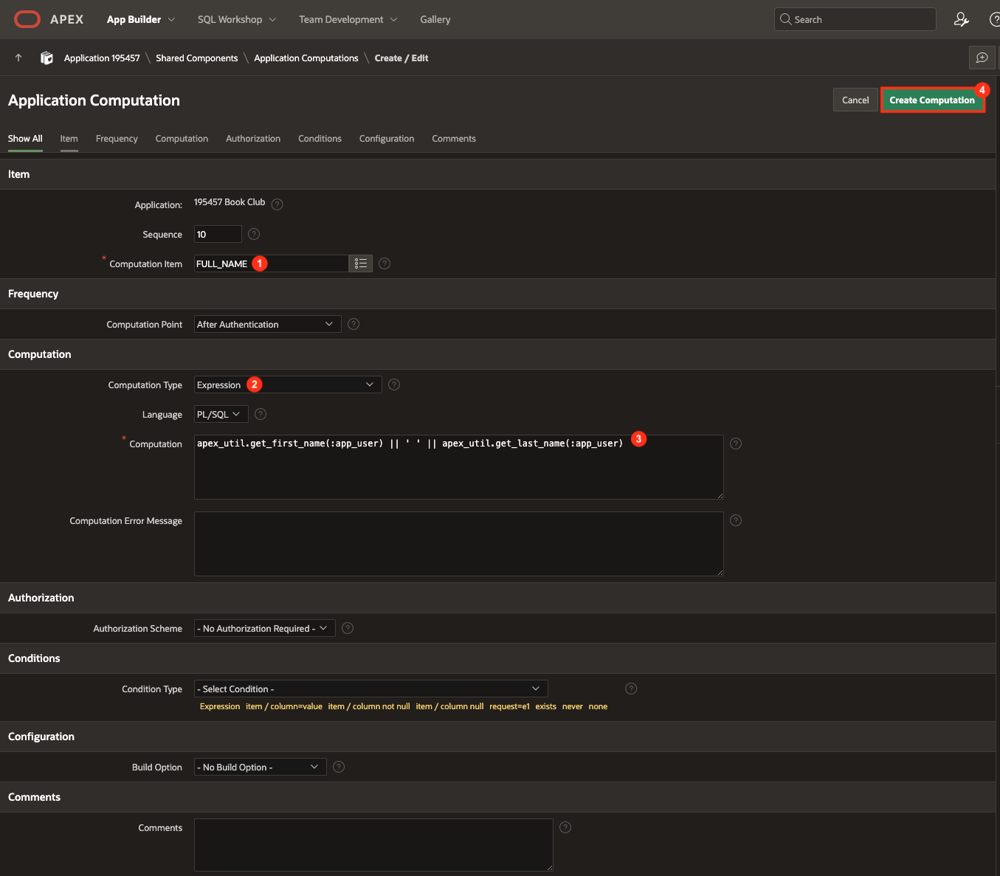

8. You have now set up an application item that computes and stores the current user's full name.

## Task 2: Create the Reviews Table
First you'll need to create a Reviews table to store book reviews. The table will have a foreign key, book\_id, that will link it to the Library table and allow different users to write a review for a specified book.

1. In the Page Designer tab in your browser, click the down arrow next to SQL Workshop in the APEX navigation bar, hover over Utilities, and select **Quick SQL**. 

2. Copy the code below and paste into the first line of the code editor:

    ```
    <copy>
    reviews /auditcols
        book_id vc
        post_comment
        rating num
        mood
        pace
        full_name
    ```

    *Note: Here you are using 'auditcols' Quick SQL shortcut, which is just another way to add audit columns to the table. In previous labs, we did this by opening Settings and checking the Audit Columns checkbox.*

3. Click the **Review and Run** button. 

    

4. Enter **Create reviews** as the name for the script and select **Run**.

    

5. Click **Run Now**. You should see a success page with 2 statements successfully processed.

    

6. Now you'll need to add an index to the Reviews table on the BOOK_ID column since you'll be passing that value from the Library table.

7. Click the down arrow next to SQL Workshop in the APEX navigation bar and select **Object Browser**.

8. On the left side, select the **REVIEWS** table.

9. Click on **BOOK_ID** then click **Modify Column**.

    * Semantics: **Byte**

    * Nullable: **off**

    * Click **Apply**

    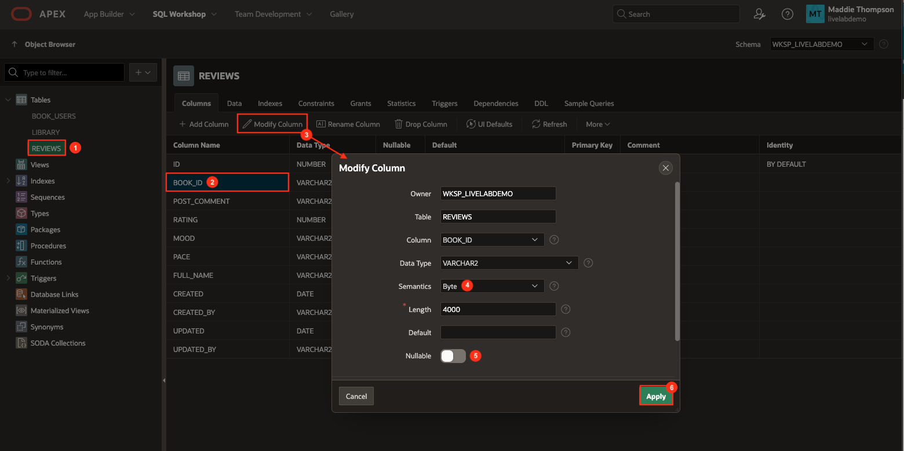

10. Click on the **Indexes** tab.

11. Click the **Create** button and configure the new index:

    * Index Name: **REVIEWS_FK**

    * Index Column 1: **BOOK_ID (VARCHAR2)**

    * Click **Create Index**

    

## Task 3: Create the Review Form Page

1. Navigate to the Book Club application home page and click **Create Page**.

    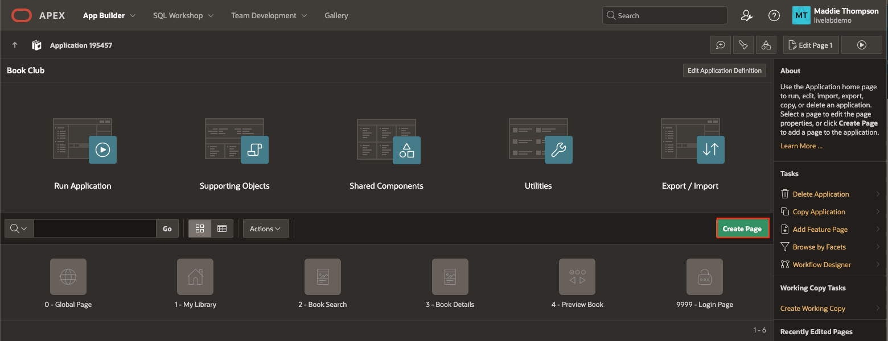

    * Click **Form**.

    * Page Number: **5**

    * Name: **Rate Book**

    * Page Mode: **Modal Dialog**

    * Data Source: **Local Database**

    * Source Type: **Table**

    * Table / View Name: **REVIEWS**

    * Click **Next**.

    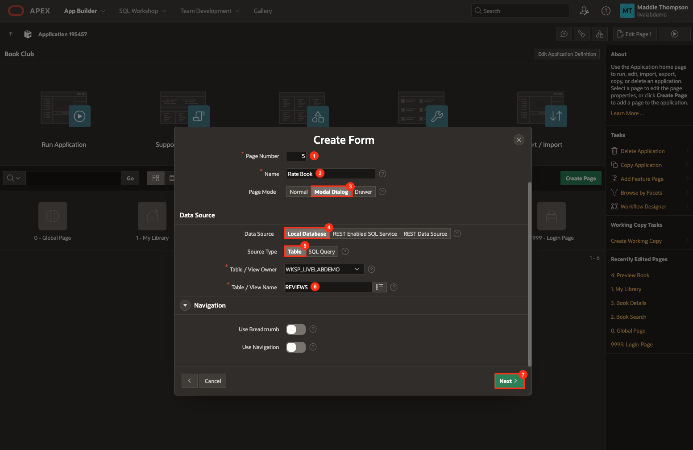

    * Select **ID (Number)** as the Primary Key Column 1 value.

    * Click **Create Page**.

    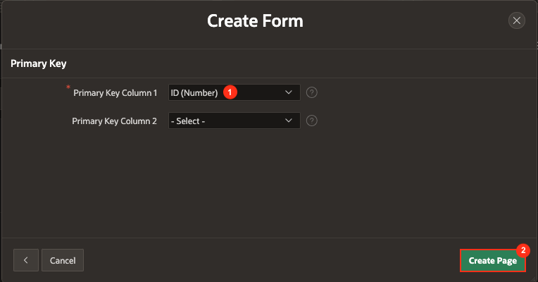

    * You should now be on page 5, the **Rate Book** page.

2. Make sure **Page 5: Rate Book** is selected in the rendering pane on the left:

    * Appearance → open the Template Options dialog:

        - Check **Stretch to Fit Window** box

        - Click **Ok**

        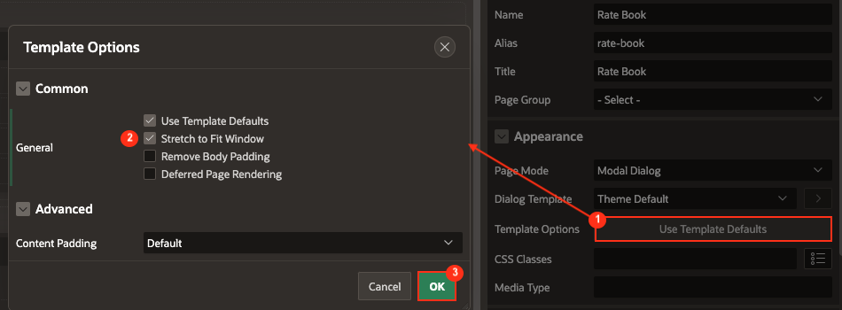

3. In the **CSS** property group, paste the code below and into the **Inline** CSS code editor:

    ```
    <copy>
    /* remove border and shadow around book header card */
    .book-header-card.a-CardView {
        border: none;
        box-shadow: none;
    }

    .subtitle {
        font-size: 14px;
    }

    /* decrease space between book header and form fields */
    .t-Dialog-body {
        padding-top: 0;
    }

    .a-CardView-items--row {
        padding-bottom: 0;
    }

    /* increase font size of form labels */
    .t-Form-fieldContainer--floatingLabel.apex-item-wrapper--star-rating .t-Form-label, .t-Form-fieldContainer--floatingLabel.js-show-label .t-Form-label {
        font-size: 14px;
    }

    /* increase space between form items */
    .row {
        padding-bottom: 0.5rem;
    }

    /* make rating stars larger */
    .apex-item-wrapper--star-rating .a-StarRating-star.fa {
        font-size: 24px;
    }

    .a-StarRating-star.fa-lg:before {
        width: 24px;
    }

    /* align error message with rating field */
    .a-Form-error {
        align-content: flex-end;
    }
    ```

    

4. Now you need to hide the audit column fields from the form. To do this, you can set the Type of a column to Hidden, which will not display an item on the frontend.

    * Click on **P5\_BOOK\_ID** then hold command and click on **P5\_FULL\_NAME**, **P5\_CREATED**, **P5\_CREATED\_BY**, **P5\_UPDATED**, and **P5\_UPDATED\_BY**.

    * In the Page Items editing pane, set Type: **Hidden**

    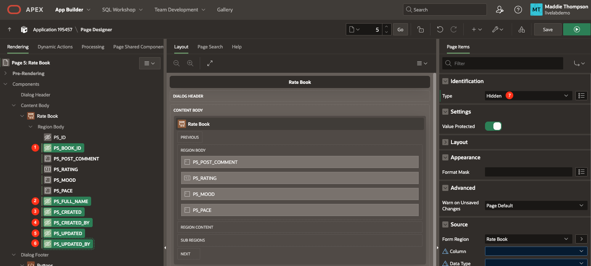

5. Reorder the form page items by dragging them to match the order in the screenshot below.

    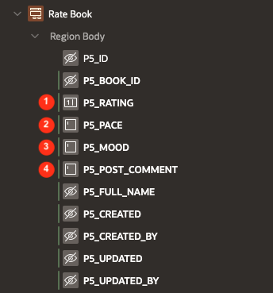

6. Click on the **P5\_RATING** page item and set the following properties:

    * Identification → Type: **Star Rating**

    * Label → Label: **Your rating:**

    * Settings → Use Defaults: **off**

    * Settings → Icon: **fa-star fa-lg**

    * Settings → Active Color: **#464c69**

    * Settings → Show Value: **on**

    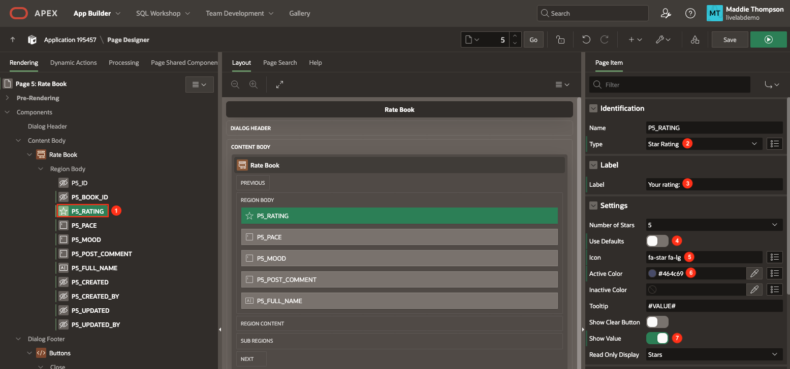

7. Click on the **P5\_PACE** page item and set the following properties:

    * Identification → Type: **Radio Group**

    * Label → Label: **How would you rate the pace of the book?**

    * Settings → Number of Columns: **3**

    * Appearance → open the Template Options dialog:

        - Item Group Display: **Display as Pill Button**

        - Click **Ok**

        

    * List of Values → Type: **Static Values**

    * List of Values → open the Static Values dialog:

        - Display Value: **Slow**, Return Value: **Slow**

        - Display Value: **Medium**, Return Value: **Medium**

        - Display Value: **Fast**, Return Value: **Fast**

        - Sort → Sort at Runtime: **off**

        - Click **Ok**

        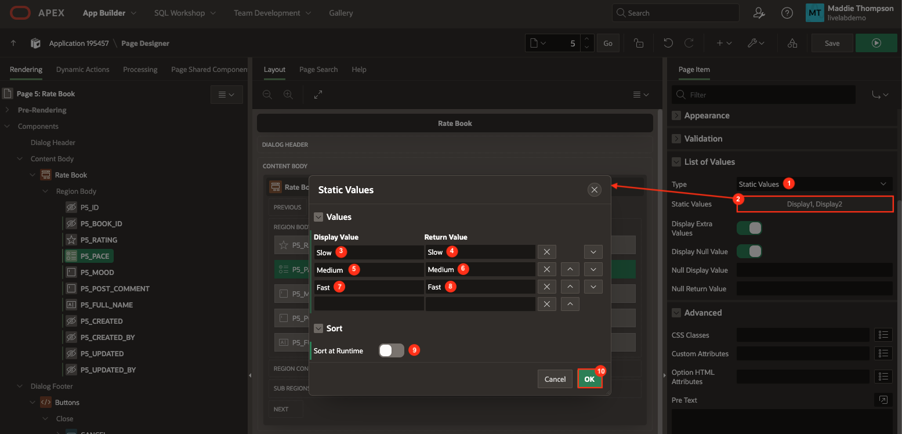

    * List of Values → Display Extra Values: **off**

    * List of Values → Display Null Value: **off**

    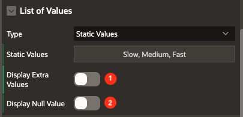

8. Click on the **P5\_MOOD** page item and set the following properties:

    * Identification → Type: **Checkbox Group**

    * Label → Label: **This book would be for someone who is in the mood for something:**

    * Settings → Number of Columns: **6**

    * Appearance → open the Template Options dialog:

        - Select **Stretch Form Item**

        - Click **Ok**

        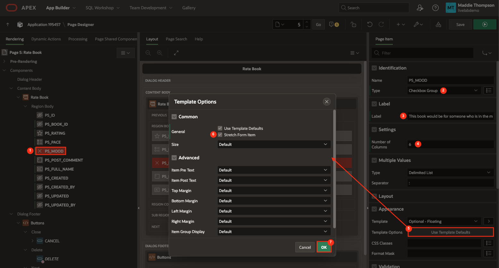

    * List of Values → Type: **Static Values**

    * List of Values → open the Static Values dialog:

        - Display Value: **Adventurous**, Return Value: **Adventurous**

        - Display Value: **Challenging**, Return Value: **Challenging**

        - Display Value: **Dark**, Return Value: **Dark**

        - Display Value: **Emotional**, Return Value: **Emotional**

        - Display Value: **Funny**, Return Value: **Funny**

        - Display Value: **Hopeful**, Return Value: **Hopeful**

        - Display Value: **Informative**, Return Value: **Informative**

        - Display Value: **Inspiring**, Return Value: **Inspiring**

        - Display Value: **Lighthearted**, Return Value: **Lighthearted**

        - Display Value: **Mysterious**, Return Value: **Mysterious**

        - Display Value: **Reflective**, Return Value: **Reflective**

        - Display Value: **Relaxing**, Return Value: **Relaxing**

        - Display Value: **Sad**, Return Value: **Sad**

        - Display Value: **Tense**, Return Value: **Tense**

        - Display Value: **Creepy**, Return Value: **Creepy**

        - Display Value: **Happy**, Return Value: **Happy**

        - Display Value: **Scary**, Return Value: **Scary**

        - Display Value: **Historical**, Return Value: **Historical**

        - Display Value: **Futuristic**, Return Value: **Futuristic**

        - Display Value: **Romantic**, Return Value: **Romantic**

        - Display Value: **Mystical**, Return Value: **Mystical**

        - Display Value: **Touching**, Return Value: **Touching**

        - Display Value: **Gross**, Return Value: **Gross**

        - Display Value: **Educational**, Return Value: **Educational**

        - Click **Ok**

        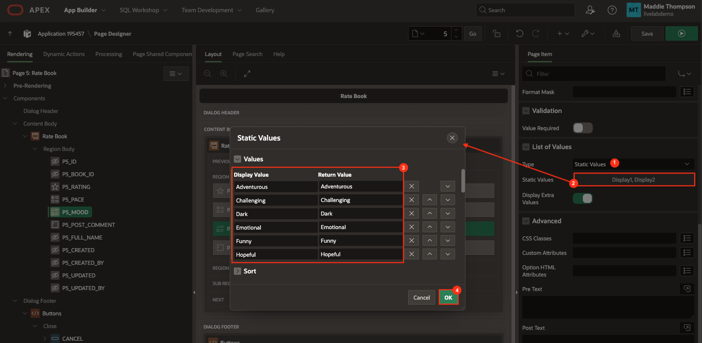

9. Click on the **P5\_POST\_COMMENT** page item and set the following properties:

    * Label → Label: **What did you think?**

    * Settings → Auto-Height: **on**

    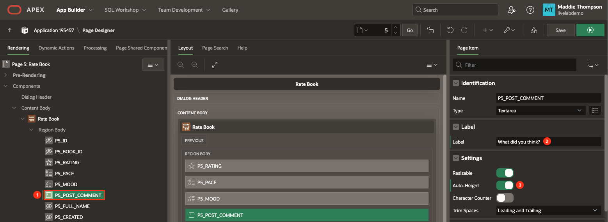

## Task 4: Create Form Field Validations
In this task you will create validations on two form fields - Rating and Mood.

1. To limit the number of checkboxes a user can check for the P5\_MOOD form field, you'll need to create a validation.

2. Right-click on **P5\_MOOD** and select **Create Validation**:

    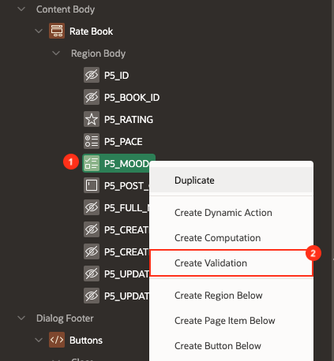

    * Identification → Name: **Validate # of selected checkboxes**

    * Validation → Type: **Function Body (Returning Error Text)**

    * Validation → PL/SQL Function Body Returning Error Text:

            ```
            <copy>
            DECLARE
            l_arr apex_t_varchar2;
            BEGIN
            l_arr := apex_string.split(:P5_MOOD,':');
            IF l_arr.COUNT > 6 THEN 
                RETURN 'Can only select 6 values';
            ELSE
                RETURN NULL;
            END IF;
            END;
            ```

    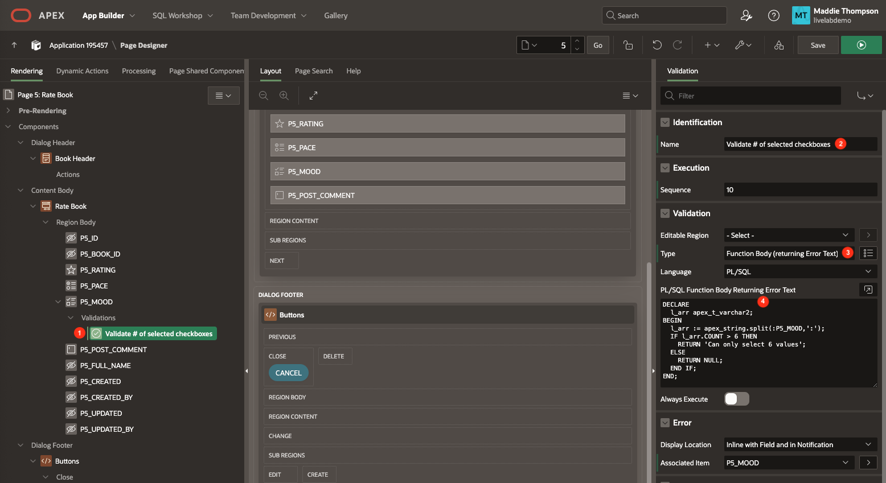

3. In order to prevent a user from creating a blank post, you need to ensure they have entered a value for P5\_RATING.

4. Right-click on **P5\_RATING** and select **Create Validation**:

    * Identification → Name: **Value required**

    * Validation → Language: **SQL**

    * Validation → SQL Expression:

            ```
            <copy>
            :P5_RATING > 0
            ```

    * Error → Error Message: **You must provide a rating!**

    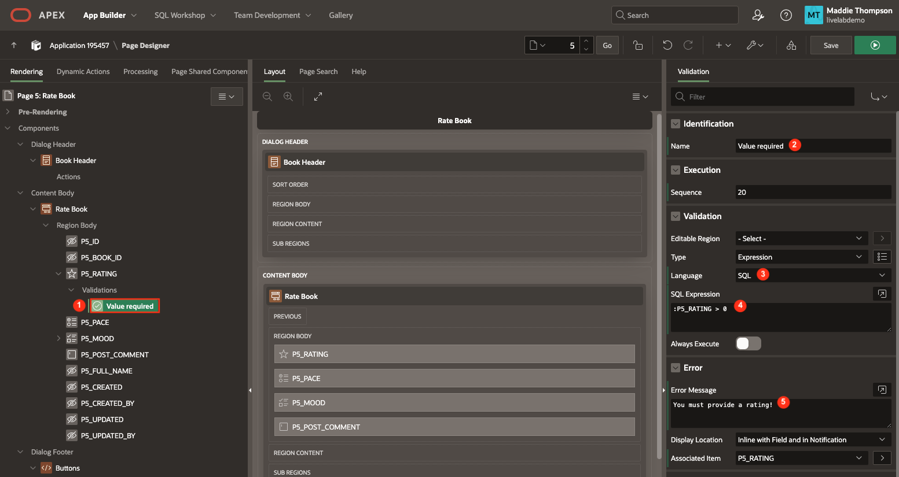

## Task 5: Create the Book Header Card
In this task you will create a simple card in the Dialog header that contains the selected book's thumbnail, title and author so the user can easily see which book they are writing a review for.

1. Right-click **Dialog Header** in the left rendering pane and select **Create Region**.

    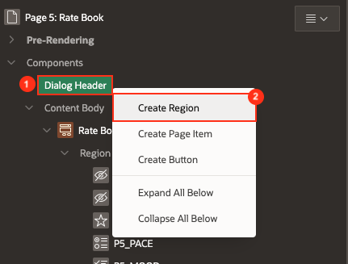

2. Set the following properties:

    * Identification → Name: **Book Header**

    * Identification → Type: **Cards**

    * Source → Type: **SQL Query**

    * Source → SQL Query:

            ```
            <copy>
            select ID,
                BOOK_ID,
                TITLE,
                THUMBNAIL,
                CREATED_BY,
                REPLACE(REPLACE(REPLACE(AUTHORS, '["', ''), '"]', ''), '"', ' ') as AUTHORS_CLEAN
            from LIBRARY
            where BOOK_ID = :P5_BOOK_ID
                and CREATED_BY = :APP_USER
            ```

    * Appearance → Template Options:

        - Style: **Style A**

        - Click **Ok**.

        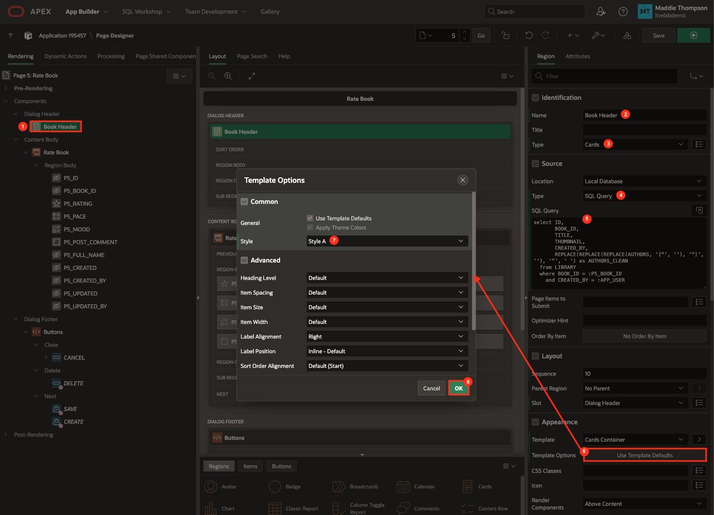

3. Click on the Attributes tab of your new Book Header region to customize the book overview card.

    * Appearance → Layout: **Horizontal (Row)**

    * Card → CSS Classes: **book-header-card**

    * Card → Primary Key Column 1: **ID**

    * Title → Column: **TITLE**

    * Title → CSS Classes: **title**

    * Subtitle → Column: **AUTHORS\_CLEAN**

    * Subtitle → CSS Classes: **subtitle**

    * Icon and Badge → Icon Source: **Image URL**

    * Icon and Badge → Image URL: **&THUMBNAIL.**

    * Icon and Badge → Icon CSS Classes: **h50**

    

## Task 6: Define Form Dialog Buttons

1. In the left rendering pane in the Dialog Footer > Buttons region, right-click on **DELETE** and select **Delete**.

    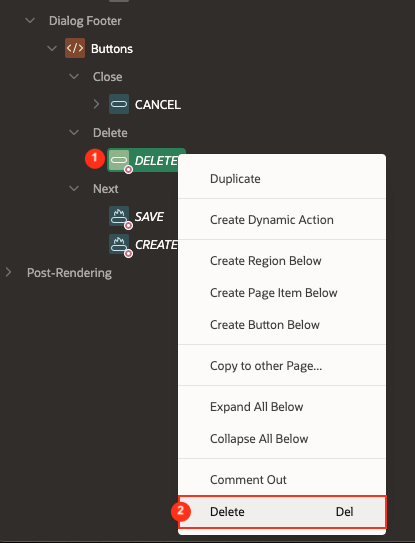

2. Click on the **SAVE** button in the rendering pane and set the following:

    * Identification → Button Name: **POST**

    * Identification → Label: **Post**

    * Behavior → Database Action: **SQL INSERT action**

    * Server-side Condition → Type: **No Rows returned**

    * Server-side Condition → SQL Query:

		```
	    <copy>
        select null
        from reviews
        where id = :P5_ID
	    ```

    *Note: You are adding a server-side condition to this button because the user should only see the POST button if they have not yet created a review for the selected book (SQL INSERT action). Otherwise, you will show a SAVE button that updates the original review and corresponding database record (SQL UPDATE action).*

    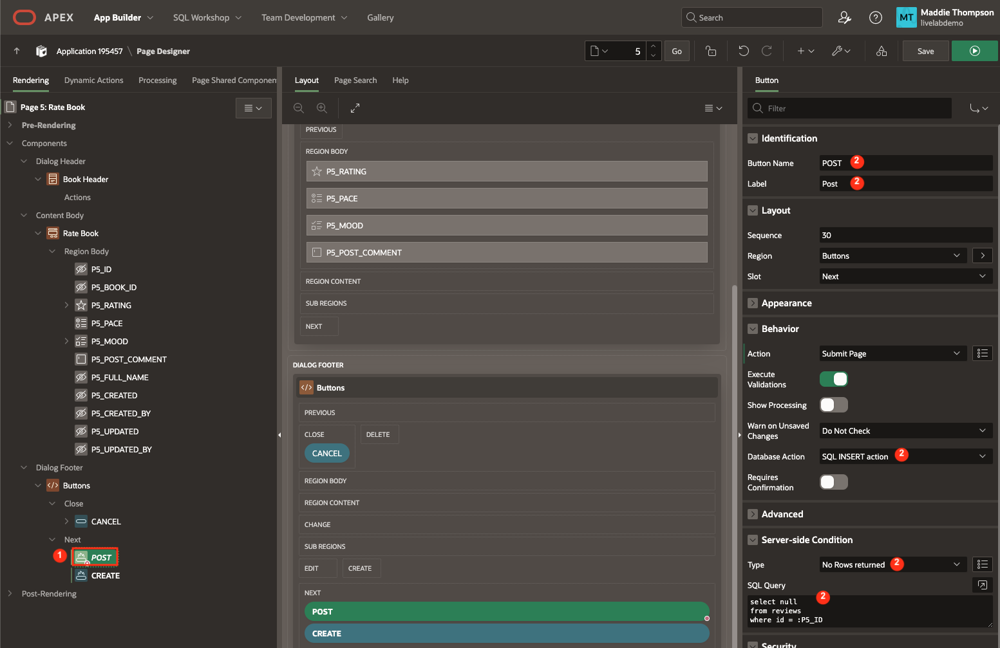

3. Click on the **CREATE** button in the rendering pane and set the following:

    * Identification → Button Name: **UPDATE**

    * Identification → Label: **Save**

    * Behavior → Database Action: **SQL UPDATE action**

    * Server-side Condition → Type: **Rows returned**

    * Server-side Condition → SQL Query:

		```
	    <copy>
        select null
        from reviews
        where id = :P5_ID
	    ```

    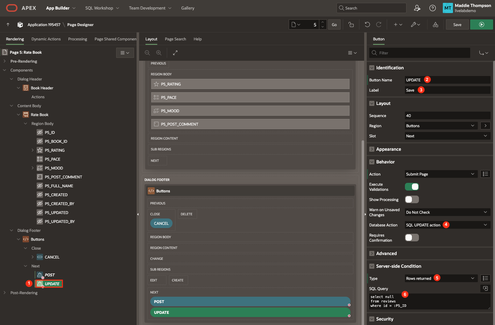

## Task 7: Implement Button Actions

1. At the top of the rendering pane, click the **Processing** tab.

2. Right-click on Processing and select **Create Process**.

    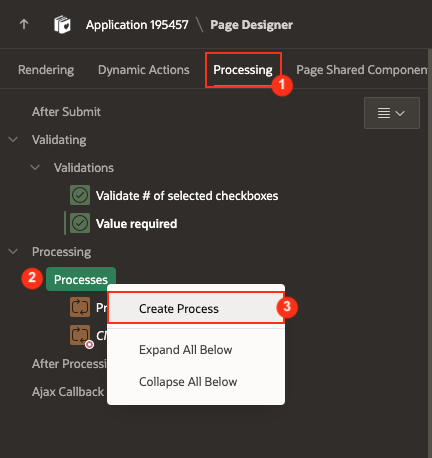

    * Identification → Name: **Add Post**

    * Identification → Type: **Execute Code**

    * Copy the following code and paste it into the PL/SQL code box in the Source property group:

        ```
        <copy>
        insert into reviews
            (
                id,
                book_id,
                post_comment,
                rating,
                mood,
                pace,
                full_name
            )
        values
            (
                :P5_ID,
                :P5_BOOK_ID,
                :P5_POST_COMMENT,
                :P5_RATING,
                :P5_MOOD,
                :P5_PACE,
                :FULL_NAME
            );
        ```

    * Success Message → Success Message: **Posted!**

    * Server-side Condition → When Button Pressed: **POST**

    

3. Right-click on Processing and select **Create Process**.

    * Identification → Name: **Update Post**

    * Identification → Type: **Execute Code**

    * Copy the following code and paste it into the PL/SQL code box in the Source property group:

        ```
        <copy>
        update reviews
        set post_comment = :P5_POST_COMMENT,
            rating = :P5_RATING,
            mood = :P5_MOOD,
            pace = :P5_PACE
        where id = :P5_ID;
        ```

    * Success Message → Success Message: **Posted updated!**

    * Server-side Condition → When Button Pressed: **UPDATE**

    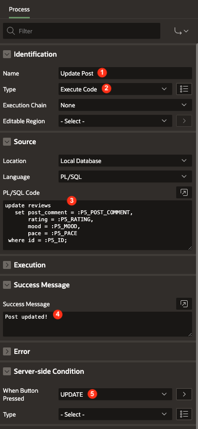

4. Right-click on the process that was created by default, **Process form Rate Book**, and select **Delete**.

    

    *If you leave this process here you'll get a unique constraint violated error when trying to submit the form.*

5. After processing is complete, you want to take the user back to the Book Details page so they can see their new or updated post. To do this, you'll need to add a branch for after processing.

6. Right-click on **After Processing** and select **Create Branch**.

    

    * Identification → Name: **Redirect to Book Details Page**

    * Click on **No Link Defined** next to Target to open the Link Builder dialog.

        - Page: **3**

        - Set Items:

            - Name: **P3\_ID**  |  Value: **&P5\_BOOK\_ID.**

        - Click **Ok**.

    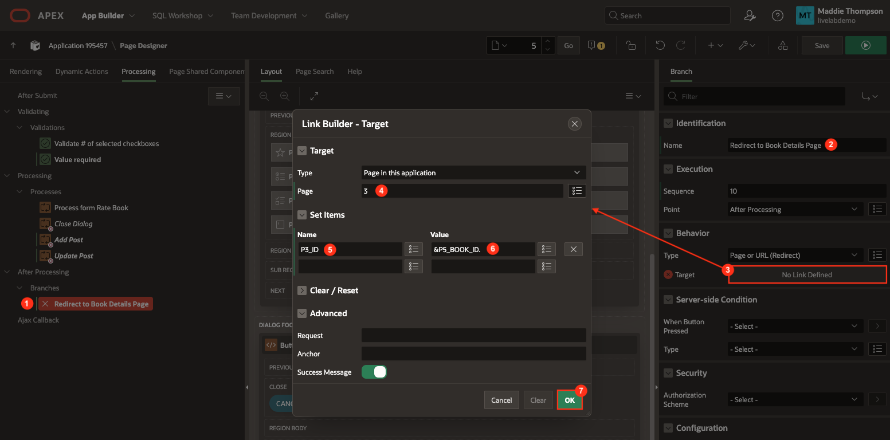

7. Click **Save**.

You now have a form dialog page that allows users to review books and have learned how to create validations on form fields and use buttons/processes to insert the form data into your table. You may now **proceed to the next lab**.

## Acknowledgements

- **Author** - Maddie Thompson
- **Last Updated By/Date** - Maddie Thompson, November 2024